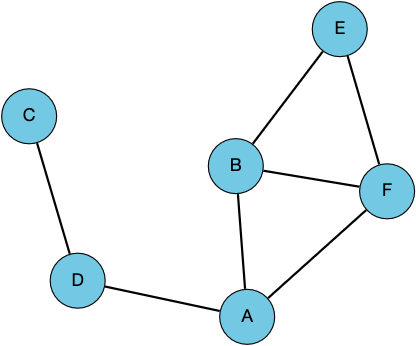

# Module 1 Part 1: Python Warmup

This Python warmup assignment will review installation and GitHub classroom instructions, provide practice working with lists and dictionaries, and introduce two ways to store graphs.

**Assignment Out:** Monday, Aug 31
_Suggested Deadline:_ Monday, Sept 7
**Assignment Due:** Monday, Sept 14

## 1. Installing Python3 and Working with `run.py`

Decide how you want to complete programming assignments in this class. I have enabled repl.it for executing this code in a web-based Integrated Development Environment (IDE), but a more stable way to complete these assignments is to install Python3 and an editor of your choice on your laptop.  Follow the instructions posted on [Moodle's "Getting Started"](https://moodle.reed.edu/course/view.php?id=3302&section=1) page.  I'd suggest the Anaconda and Spyder installation instructions that is used for Math121.  

This assignment requires you to download and modify `run.py`.  In a few weeks, we will learn about [Git](https://git-scm.com/) and [GitHub](https://github.com/); if you know these tools you are free to fork this repo.  For now, though, you will follow these instructions to modify `run.py` and, once you are satisfied with the assignment, you will submit the `run.py` file via Moodle.

Once you have installed Python3 and have your editor of choice, you should be able to download `run.py` and run it without errors.  Refer to the [Moodle Python Resources](https://moodle.reed.edu/mod/page/view.php?id=141006) page or the [Bio131 Python Crashcourse](https://annaritz.github.io/python-crashcourse/) for syntax refreshers.

## 2. Working with Adjacency Matrices

Suppose we want to describe the following graph, which has six nodes (`A`-`F`) and seven undirected edges.



This graph can be represented as an [adjacency matrix](https://mathworld.wolfram.com/AdjacencyMatrix.html), where entry $(i,j)$ in the matrix is $1$ if the $i$th node is connected to the $j$th node and $0$ otherwise.

```
  A B C D E F
A 0 1 0 1 0 1
B 1 0 0 0 1 1
C 0 0 0 1 0 0
D 1 0 1 0 0 0
E 0 1 0 0 0 1
F 1 1 0 0 1 0
```

In `run.py`, Line 12 assigns a list of nodes to the `nodes` variable and Line 14 assigns a list of lists to the `adj_mat` variable.

**Task**: write a `print_mat()` function to print the adjacency matrix _exactly_ as shown above (including spacing).  This function takes two arguments, `nodes` and `adj_mat`, and returns nothing (this [pythontutor example](http://pythontutor.com/visualize.html#code=%23%20example%20from%20https%3A//www.reddit.com/r/learnpython/comments/8k7h3z/print_vs_return/%0A%0A%23%20define%20two%20functions%3A%20one%20prints%205%20and%20one%20returns%205.%0Adef%20print_5%28%29%3A%0A%20%20%20%20print%285%29%0A%20%20%20%20%0Adef%20return_5%28%29%3A%0A%20%20%20%20return%205%0A%0Ar1%20%3D%20print_5%28%29%0Aprint%28'print_5%28%29%20returns',r1%29%0A%0Ar2%20%3D%20return_5%28%29%0Aprint%28'return_5%28%29%20returns',r2%29%0A%0Aprint%28'%22print%28%29%22%20is%20a%20function,%20but%20%22return%22%20returns%20the%20value.'%29%0A&cumulative=false&curInstr=12&heapPrimitives=nevernest&mode=display&origin=opt-frontend.js&py=3&rawInputLstJSON=%5B%5D&textReferences=false) shows the difference between `print()` and `return`).

## 3. From an Adjacency Matrix to an Adjacency List

We can also store the graph according to the neighbors of each node.  This data structure is called an [_adjacency list_](https://en.wikipedia.org/wiki/Adjacency_list), and can be implemented using [Python dictionaries](https://docs.python.org/3/library/stdtypes.html#mapping-types-dict) (look up [Dictionaries on the Bio131 Python Crashcourse website](https://annaritz.github.io/python-crashcourse/) if you need a refresher).

**Task**: Write a function `mat_to_list()` that converts an adjacency matrix to an adjacency list. The adjacency list is a dictionary of `key`,`value` pairs, where the keys are nodes and the values are a list of neighbors. (You can use [Python sets](https://docs.python.org/3/tutorial/datastructures.html#sets) instead of lists for the values, but this is optional).  The `mat_to_list()` function takes one input, `adj_mat`, and returns an `adj_list` dictionary.

The adjacency list will look like the following:

```
Node : Neighbors
A: B D F
B: A E F
C: D
D: A C
E: B F
F: A B E
```

Task: Write a `print_list()` function to print the adjacency list as shown above (the order of nodes and neighbors may be different). This function takes one input, `adj_list`, and returns nothing.

## 4. Count the number of nodes and edges, two ways.

We can now use the `adj_mat` variable and the `adj_list` variable (returned by your `mat_to_list()` function) to count the number of nodes and edges in two ways.  

**Task**: Write a `count_from_adj_mat()` function that takes one input, `adj_mat`, and returns the number of nodes and edges in the graph.

**Task**: Write a `count_from_adj_list()` function that takes one input, `adj_list`, and returns the number of nodes and edges in the graph.

Both `count_from-adj_mat()` and `count_from_adj_list()` should return the same values.  

## Submitting

**You're Done!** Before you submit `run.py` via Moodle, look through the comments and add any additional ones that explain what your code does.  You will get feedback about the amount of comments you provide.

### Instructions for resubmitting

As described on the [syllabus](https://www.reed.edu/biology/courses/bio331/files/syllabus.pdf), there is no penalty for re-submitting this assignment as long as you follow these instructions:
- You submit whatever you have by the deadline.
- You add a comment to the top of your code indicating that you plan to resubmit this assignment (e.g. "I plan to resubmit this assignment.")
- You schedule a meeting with Anna within one week of the deadline to make a plan.
All resubmissions are due by Finals Week. Email Anna if you have any questions.
